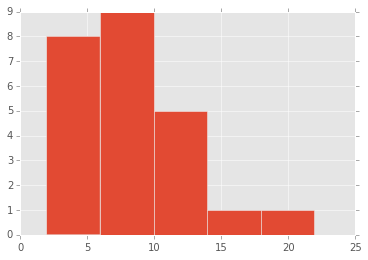
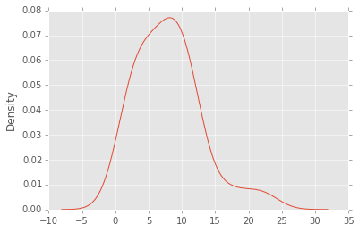
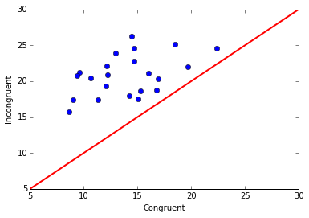

# P1 - Test a Perceptual Phenomenon

### 1. What is our independent variable? What is our dependent variable?

The independent variable is the congruence between text and color. More specifically, it is a binary variable that can take two possible values: (1) Congruent; (2) Incongruent.

The dependent variable is the time required by the participants to complete the task.
The operational definition is: the time in seconds (rounded to 4 decimal places) to complete the task, where the completion of the task is determined by the click of the button "Finish" in the browser window.

### 2. What is an appropriate set of hypotheses for this task? What kind of statistical test do you expect to perform? Justify your choices.

The null hypothesis (H0) is that the mean of the performance of the population on the congruent task would be equal to the performance on the incongruent task.

H0: μd = 0

The alternative hypothesis (Ha) is that the mean of seconds required to complete the incongruent task would be greater than the mean of seconds required to complete the congruent task.

Ha: μd > 0

Mu (μ) in the hypotheses above denotes to the population parameter and not the sample statistic, which would be denoted by x-bar (x̄).

The idea that the mean of seconds required to complete the incongruent task may be lower in the population is not considered in the hypotheses because is implausible.

The population parameter is unknown so what needs to be done is to establish what is the difference between the two dependant samples and whether this difference is significant enough to infer that the finding is true for the population, and not only the available sample.

The statistical test that will be performed is a dependent t-test for paired values. Based on the t-statistic and the p-value calculated from the t-statistic it will be possible to establish whether or not the null hypothesis can be rejected.

### 3. Report some descriptive statistics regarding this dataset. Include at least one measure of central tendency and at least one measure of variability.

- Mean of Congruent: 14.051125000000004
- Mean of Incongruent: 22.01591666666667
- Mean of Differences: 7.964791666666667

Sample standard deviations (s)
- Congruent: 3.559357957645195
- Incongruent: 4.797057122469138
- Differences: 4.864826910359056


```python
import pandas as pd
path = r'C:\Users\FarinaM\Desktop\Nano Degree\Assignments\P1 - Test a Perceptual Phenomenon\Stroop Effect Data.csv'
dataFrame = pd.read_csv(path)
```


```python
dataFrame['Congruent'].mean()
```


    14.051125000000004


```python
dataFrame['Incongruent'].mean()
```


    22.01591666666667


```python
dataFrame['Congruent'].std()
```


    3.559357957645195


```python
dataFrame['Incongruent'].std()
```


    4.797057122469138


```python
# Add column with differences to dataFrame
dataFrame['Differences'] = dataFrame['Incongruent'] - dataFrame['Congruent']
```


```python
dataFrame['Differences'].mean()
```


    7.964791666666667


```python
dataFrame['Differences'].std()
```


    4.864826910359056


### 4. Provide one or two visualizations that show the distribution of the sample data. Write one or two sentences noting what you observe about the plot or plots.

The density plot and the histogram (5 bins) of the differences in result between the Congruent and Incongruent tasks show a positively skewed distribution.


```python
# Plot
%pylab inline
import matplotlib.pyplot as plt
plt.figure();
import matplotlib
matplotlib.style.use('ggplot')
dataFrame['Differences'].hist(bins=5)
```

    Populating the interactive namespace from numpy and matplotlib
    


    <matplotlib.axes._subplots.AxesSubplot at 0xe4820f0>





```python
dataFrame['Differences'].plot(kind='kde')
```


    <matplotlib.axes._subplots.AxesSubplot at 0xe7ea8d0>





Additional visualization (suggestion from reviewer) - the "Congruent vs Incongruent" scatter plot shows that all data points are above the x=y red line.


```python
%pylab inline
import matplotlib.pyplot as plt
plt.figure();
import matplotlib
plt.plot(dataFrame['Congruent'], dataFrame['Incongruent'], 'bo')
plt.plot([5, 30], [5, 30], color='r', linestyle='-', linewidth=2)
plt.axis([5, 30, 5, 30])
plt.ylabel('Incongruent')
plt.xlabel('Congruent')
plt.show()
```

    Populating the interactive namespace from numpy and matplotlib
    





### 5. Now, perform the statistical test and report your results. What is your confidence level and your critical statistic value? Do you reject the null hypothesis or fail to reject it? Come to a conclusion in terms of the experiment task. Did the results match up with your expectations?

- Confidence level: 99.9%
- Critical t-value (based on 1 tail): 3.7676
- Number of participants (n): 24
- Degrees of freedom (df): 23
- Point estimate for μc - μi based on the sample = 7.964791666666665
- Standard deviation of the differences (S) = 4.864826910359056
- t-statistic (t) = 8.0207069441099552
- p-value = 0.0000000410

Based on the p-value, the conclusion is that the difference of the means is extremely statistically significant and the null hypothesis about the population (H0: μd = 0) is therefore rejected.

As expected, participants took a significantly greater amount of time to complete the task with the incongruent colors and texts and since this was an experimental design (within subject with pre-test and post-test) we can conclude that the incongruent colors-texts caused participants to be slower at completing the task and the finding can be generalized to the population.


```python
# Point estimate
pointEstimate = dataFrame['Incongruent'].mean() - dataFrame['Congruent'].mean()
pointEstimate
```


    7.964791666666665


```python
# Standard deviation of the differences
sdOfDiffs = dataFrame['Differences'].std()
sdOfDiffs
```


    4.864826910359056


```python
# t-statistic
import numpy as np
n = 24
t = pointEstimate / (sdOfDiffs / np.sqrt(n))
t
```


    8.0207069441099552


```python
# Alternative way of calculating the t-statistic and p-value directly from the vectors using scipy
from scipy import stats
paired_sample = stats.ttest_rel(dataFrame['Incongruent'], dataFrame['Congruent'])
print "The t-statistic is %.10f and the p-value is %.10f." % paired_sample
```

    The t-statistic is 8.0207069441 and the p-value is 0.0000000410.
    

### Sources

Python code for t-test:
http://iaingallagher.tumblr.com/post/50980987285/t-tests-in-python

Plotting with pandas:
http://pandas.pydata.org/pandas-docs/version/0.15.0/visualization.html

Scatter plot:
Suggestion from reviewer

T Distribution Critical Values Table:
https://www.easycalculation.com/statistics/t-distribution-critical-value-table.php

